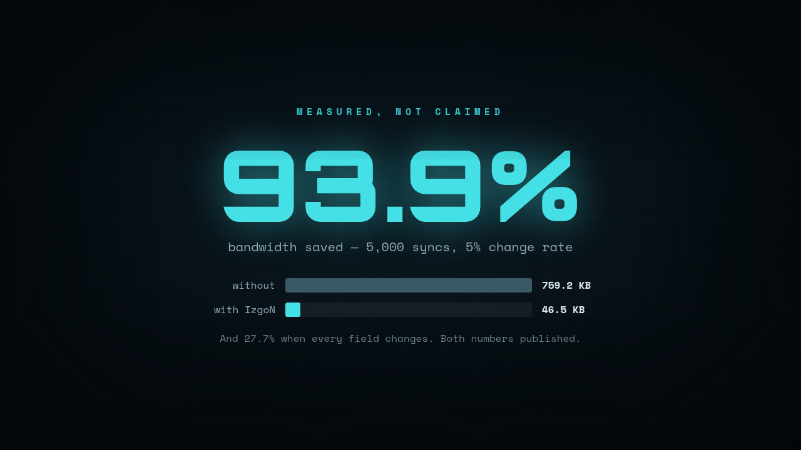

# IzgoN

**Your devices are sending the same data over and over. IzgoN sends only what changed — and shows you exactly how many bytes you stopped paying for.**

IzgoN sits between your fleet and your backend. Each node POSTs its current state; IzgoN compares it to the last state it saw, and returns `NO_CHANGE` (0 bytes of payload), a minimal JSON delta, or — when a delta would be bigger than the state it replaces — the state itself. Every call is logged, so the dashboard can tell you the one number that matters: **bytes you would have sent vs. bytes you actually sent.**

```
       node state              IzgoN                 your backend
   {"t":21.5,"h":60}  ──►  compare + diff  ──►  {"t":21.5}   (delta only)
   {"t":21.5,"h":60}  ──►  compare + diff  ──►  NO_CHANGE    (0 bytes)
```



Live demo: <https://izgon-api.onrender.com> — two caveats before you click, because
the free tier is honest about what it is. The first request takes 20–40 seconds to
wake the instance. And the counters reset to zero every time it sleeps: the free
plan has no persistent disk, so the SQLite event log goes with the container. The
image above is the same dashboard with traffic in it. To fill it yourself, point
`benchmark.py` at the demo and watch the number climb.

---

## Why not just use `jsonpatch`?

Fair question, and the honest answer is: **if you enjoy building and running that yourself, use `jsonpatch`. It's free and it works.**

`jsonpatch` gives you a diff function. IzgoN gives you:

- a running server that holds per-node baseline state, so nodes stay stateless
- a free/paid tier gate with offline license validation — no phone-home
- an event log and a dashboard
- **a savings number you can put in front of whoever pays the bill**

The diff is ~50 lines. The other four things are the product.

## Who this is for

You will get value from IzgoN if you have **many nodes reporting frequently, where most of the state doesn't change between reports**:

- IoT or sensor fleets on metered cellular / satellite SIMs
- Field agents or edge devices on constrained links
- Dashboards or monitoring agents polling every few seconds
- Game or simulation servers syncing entity state

You will **not** get value if your payloads are small, infrequent, or change completely every time. Run the benchmark below against your own data before you pay for anything — `--payload-file` takes an export of your real reports, so it is one command, not a code change.

---

## Quick start

Nothing to clone or build — the image is published:

```bash
docker run -p 8000:8000 -e DATAPULSE_API_KEY=change-me ghcr.io/izgamber/izgon:latest
```

That runs IzgoN on its own. For per-node baselines that survive a restart you
want Redis alongside it, which is what the compose file is for:

```bash
git clone https://github.com/izGamber/IZgoN.git
cd IZgoN
cp .env.example .env
docker compose up -d
```

Open <http://localhost:8000> for the dashboard.

Send a state. The node's payload goes inside `state`, and every write needs your
`X-API-Key` — it defaults to `dev-local-key` until you change it in `.env`.

```bash
curl -X POST http://localhost:8000/api/nodes/sensor-01/sync \
  -H "Content-Type: application/json" \
  -H "X-API-Key: dev-local-key" \
  -d '{"state": {"temp": 21.5, "hum": 60, "batt": 98}}'
```

Send the same state again — `NO_CHANGE`, zero delta bytes:

```json
{"node_id":"sensor-01","status":"NO_CHANGE","checksum":"4680f5c0…","delta":null,"bytes_full":32,"bytes_sent":0}
```

Change one field and only that field comes back:

```bash
curl -X POST http://localhost:8000/api/nodes/sensor-01/sync \
  -H "Content-Type: application/json" \
  -H "X-API-Key: dev-local-key" \
  -d '{"state": {"temp": 22.1, "hum": 60, "batt": 98}}'
```

---

## Measure it on your own data

Do not take anyone's benchmark on faith, including this one. `benchmark.py` ships in
the repo and uses only the Python standard library.

**Point it at your own reports. One command:**

```bash
python3 benchmark.py --payload-file my-reports.json
```

The file is a JSON array, or JSON Lines, of reports your devices actually sent —
export a few thousand rows from wherever you already store them. Each device
replays its own real sequence in its real order, and the change rate is *measured
from your data*, not assumed:

```
IzgoN benchmark — replaying 4,812 of your own reports from 37 device(s)
Observed change rate: 6.4%  — measured from your data
```

Common shapes are handled without editing anything. The device id is picked up
automatically from `node_id`, `device_id`, `deviceId`, `device`, `id` or `serial`;
override with `--id-field`. If each record wraps the payload, unwrap it:

```bash
python3 benchmark.py --payload-file logs.jsonl --state-field state --id-field device_id
python3 benchmark.py --payload-file logs.jsonl --price-per-mb 0.05   # prints money, not just bytes
```

Each run uses its own node-id namespace, so a second run starts from a clean
baseline and cannot inherit the first run's state and quietly inflate the result.

**If you have no sample yet**, the synthetic mode shows the shape of the curve:

```bash
python3 benchmark.py --nodes 50 --rounds 100 --change-rate 0.05
```

Measured results, all reproducible with the commands in [BENCHMARK.md](BENCHMARK.md):

| Change rate | Without IzgoN | With IzgoN | Saved |
|---|---|---|---|
| 5 % | 759.2 KB | 43.0 KB | **94.3 %** |
| 20 % | 758.2 KB | 147.5 KB | **80.5 %** |
| 70 % | 758.4 KB | 490.4 KB | **35.3 %** |

**Read the last row.** When almost every report differs from the one before it, the
saving falls to 35.3 % and most of the point of running this disappears. That is the
honest boundary of the tool. Measure your own payloads before you buy anything — if
the number is small for your data, don't.

> These figures moved up in v1.1.0, and the reason matters more than the numbers.
> Until v1.1.0 the "would have sent" side was measured with compact JSON while the
> "actually sent" side used Python's default `json.dumps` spacing — two rulers, so
> every published saving was wrong, understated by roughly two bytes per field.
> Both sides are compact now. The old figures (93.9 / 78.6 / 27.7 %) were too low,
> not too high; anything published before this date understates the tool.

---

## API

| Method | Path | Auth | Purpose |
|---|---|---|---|
| `POST` | `/api/nodes/{id}/sync` | API key | Submit node state, get `NO_CHANGE` or delta |
| `GET` | `/api/nodes` | API key | List known nodes and their baselines (paged, `?limit=` up to 5000) |
| `GET` | `/api/metrics` | — | Live totals: bytes full, bytes sent, savings |
| `GET` | `/api/license` | — | Current tier and remaining free syncs |
| `GET` | `/healthz` | — | Redis reachability |
| `GET` | `/` | — | Dashboard |

### Response shape

```json
{
  "node_id": "sensor-01",
  "status": "SYNC_REQUIRED",
  "checksum": "e163cdfd20a3617d2fe560a3dd849c2fb8e7c8041c7a49fd225bea93be26ad33",
  "delta": { "temp": 22.1 },
  "bytes_full": 32,
  "bytes_sent": 13
}
```

`node_id` must be 1–128 characters of `A–Z a–z 0–9 . _ : -`. Anything else is
rejected with `422`: node ids become Redis keys and log rows, so an unbounded id
is an unbounded memory cost.

`status` is one of three values, and a client must handle all three:

| `status` | `delta` holds | What the client does |
|---|---|---|
| `NO_CHANGE` | `null`, `bytes_sent` is `0` | nothing — both sides already agree |
| `SYNC_REQUIRED` | only the changed keys | **merge** it into the known state |
| `FULL_STATE` | the complete new state | **replace** the known state with it |

`FULL_STATE` exists because a delta is not always smaller. Drop enough keys at once
and the deletion markers outweigh what is left — `{"a":1}` is 7 bytes, while the
delta that removes four sibling keys is 101. Sending that delta would cost you money
to save you nothing, so IzgoN sends the state instead and says so. `bytes_sent` can
therefore never exceed `bytes_full`, and a measured saving can never come out
negative. A client that only knows the first two statuses should treat an unknown
one as "resync from scratch", which is exactly right.

`checksum` is a SHA-256 of the stored state, so a client can confirm both sides agree
without transferring anything. `bytes_full` and `bytes_sent` are both compact JSON —
one ruler on both sides, so the difference between them is a real number.

Nested objects are diffed recursively. **Lists are compared as a whole, not element
by element** — if one item in a list changes, the whole list is sent. This is a
deliberate limitation; see [Limitations](#limitations).

### Applying what comes back

`izgon_client.py` in the repo is a ~60-line, stdlib-only reference client. It is not
an SDK — it is the smallest correct implementation of the three statuses, short
enough to read in one sitting and copy into whatever language you actually use:

```python
from izgon_client import IzgonClient

c = IzgonClient("http://localhost:8000", "dev-local-key")
mirror = {}
for report in my_reports:
    mirror = c.sync("sensor-01", report, mirror)
    # mirror now equals report, having transferred only what changed
```

The merge rule it implements: nested objects merge recursively, and
`{"__deleted__": true}` removes a key. Verified by replaying 720 randomised
mutations — nested objects, lists, nulls, booleans, keys appearing and
disappearing — and asserting after **every** sync that the reconstructed state is
byte-identical to what was sent.

---

## Configuration

All settings are environment variables. Copy `.env.example` to `.env` and edit.

| Variable | Default | Meaning |
|---|---|---|
| `DATAPULSE_REDIS_URL` | `redis://localhost:6379/0` | Redis connection. Holds per-node baseline state. |
| `DATAPULSE_DB_PATH` | `datapulse_events.db` | SQLite file for the event log. |
| `DATAPULSE_API_KEY` | `dev-local-key` | Key for authenticated endpoints. **Change this.** |
| `DATAPULSE_FREE_TIER_LIMIT` | `10000` | Free syncs before `402`. Enough to run the benchmark and evaluate. |
| `DATAPULSE_LICENSE_KEY` | — | Paid licence key. The only licence value you set. |
| `DATAPULSE_LICENSE_PUBKEY` | built in | Seller's Ed25519 public key. Only override it if you were told to. |
| `DATAPULSE_ALLOW_MEMORY_FALLBACK` | `1` | Keep node state in memory when Redis is unreachable. `0` fails instead. |
| `DATAPULSE_ALLOWED_ORIGINS` | `*` | CORS origins. **Narrow this in production.** |
| `DATAPULSE_MAX_STATE_DEPTH` | `32` | Reject `state` nested deeper than this with `422`. |
| `DATAPULSE_MAX_STATE_BYTES` | `1048576` | Reject a `state` larger than this with `413`. |

---

## Licence and price

IzgoN is **source-available, not open source.** You can read, run, and modify it for yourself.

- **Free tier** — 10,000 syncs, no key needed. Enough to run the benchmark on your own payloads and decide.
- **Commercial licence** — one-time payment, no subscription, no phone-home. The key carries an Ed25519 signature which your instance verifies locally against a public key shipped inside IzgoN, so it never talks to a licence server.

**Start on the free tier.** 10,000 syncs is enough to run the benchmark against your
own payloads and decide whether this is worth anything to you. No account, no card,
no sign-up — `git clone` and `docker compose up -d`.

Checkout is being set up. Until it is live, open an issue titled `licence` and I will
send you one; the price does not change.

A licence is one value. Put it in your `.env`:

```
DATAPULSE_LICENSE_KEY=IZG2-....................=..........
```

Restart, then check `GET /api/license` shows `"licensed": true`. There is nothing
else to configure: the key is signed by the seller, and IzgoN verifies that
signature offline with a public key it already carries.

What this does and does not do, stated plainly: nobody can forge a key without the
seller's private half, but IzgoN publishes its own source, so anyone can delete the
check. That is a breach of the licence with a legal remedy, not a technical
impossibility. The key is an honest record of who paid, not a lock.

---

## Security notes

Read these before you put it on anything reachable from outside:

- **`DATAPULSE_API_KEY` protects every write.** It ships as `dev-local-key`.
  Change it. The comparison is constant-time, so the key cannot be recovered by
  timing the responses.
- **`/api/metrics` and `/healthz` are deliberately unauthenticated** so the
  dashboard and your monitoring can read them. They expose event counts, node
  counts and byte totals — no state, no keys. If that is too much for your
  deployment, put them behind your reverse proxy.
- **`DATAPULSE_ALLOWED_ORIGINS` defaults to `*`.** Narrow it to your own origin
  before exposing the dashboard publicly.
- **There is no built-in rate limiting.** Put it behind nginx, Caddy or your
  cloud load balancer if it faces the internet.
- **`state` is bounded in depth and size** (32 levels, 1 MB) and both limits are
  checked before anything touches the payload. Without them a 1.8 KB body nested
  300 levels deep was enough to return a `500`.
- **Your licence key and signing secret belong in `.env`, never in git.** The
  shipped `.gitignore` already excludes `.env`, `sales.log` and `*.db`.

## Limitations

Stated plainly, because you will find them anyway:

- **Lists are not diffed element by element.** Change one entry in a 500-item array and the whole array is sent. If your payloads are list-heavy, savings will be much lower than the benchmark suggests.
- **A shrinking payload saves you nothing.** When keys disappear, the deletion markers can be bigger than the state that is left. IzgoN detects that and sends the state whole (`FULL_STATE`), so you never pay *more* than sending everything — but you save nothing on that sync either.
- **The first report from any node is always sent in full.** There is nothing to compare it against. On a short sample this drags the average down, correctly.
- **Baseline state lives in Redis.** If Redis is wiped, every node sends full state once to re-establish its baseline. Use a persistent Redis volume — the shipped `docker-compose.yml` does.
- **Single instance.** There is no clustering. One IzgoN process owns the baselines.
- **No client SDK yet.** Integration is a plain HTTP POST; there is no packaged library.

---

## Running without Docker

```bash
pip install -r requirements.txt
export DATAPULSE_REDIS_URL=redis://localhost:6379/0
uvicorn app:app --host 0.0.0.0 --port 8000
```

Requires a reachable Redis.

---

## Status

Version 1.1.1 — see [CHANGELOG.md](CHANGELOG.md). Built and maintained by one person.
If something is broken, open an issue and say what you sent and what you got back.
